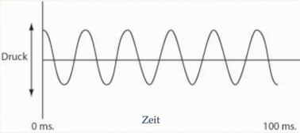
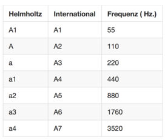
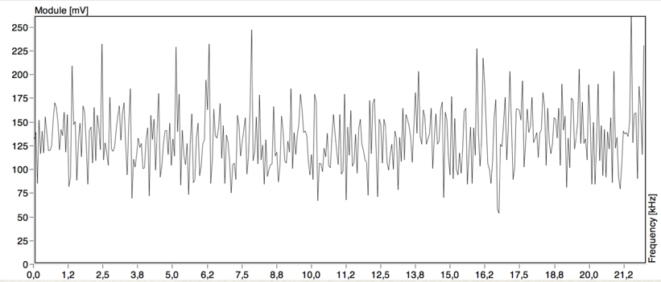
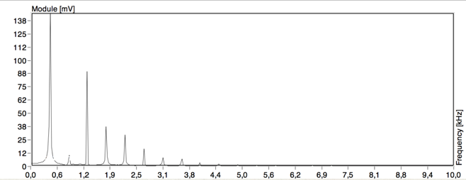

# 1 Grundkentnisse
 
Die Wellenform ist die Gestalt und die Form des zeitlichen Verlaufs der Veränderung einer Größe einer Schwingung. Sie kann auch durch eine abstrakte Darstellung beschrieben werden. Meist wird der periodische oder aperiodische Verlauf physikalischer Größen betrachtet.

## Zwei Typen

### Klang (Pitched Tone)
Unter Klang versteht man in der Physik ein periodisches Schallereignis.

### Geräusch (Unpitched Tone)
Ursache für ein Geräusch sind Schwingungsvorgänge, die in der Regel nicht periodisch verlaufen und sich in ihrer Struktur zeitlich ändern können

## Frequenz

Wie schnell bei einem periodischen Vorgang die Wiederholungen aufeinander folgen. Einheit: Hz.

## Tonhöhe und Frequenz

## Periodendauer (wavelength)

Periodendauer = 1 / Frequenz
z.B. 400 Hz = 1/400 = 0,0025 sek. = 2.5 msek

Zeiteinheit

- 1 Millisekunde = 0,001 Sekunde
- 1 Mikrosekunde = 0,001 Millisekunde
- 1 Nanosekunde = 0,001 Mikrosekunde 
- 1 Pikosekunde = 0,001 Nanosekunde

##  Amplitude

Amplitude: 

Die maximale Elongation einer Schwingung, von der Position der Null- Linie aus gemessen.

## Frequenz vs Amplitude

## Wellenform

## Joseph Fourier (1768-1830)

ein französischer Mathematiker und Physiker. Mit der Fourieranalyse legte er einen Grundstein für den Fortschritt der modernen Physik und Technik.
Er entdeckte: ein periodisches Signal lässt sich durch Überlagerung von sinus- bzw. kosinusförmigen Teilschwingungen unterschiedlicher Frequenz und Amplitude erzeugen.

## Fourier Transformation

## Spektrum

## Sinus vs Rauschen

## Instrumente

### Geige

### Gittare

### Klarinette

