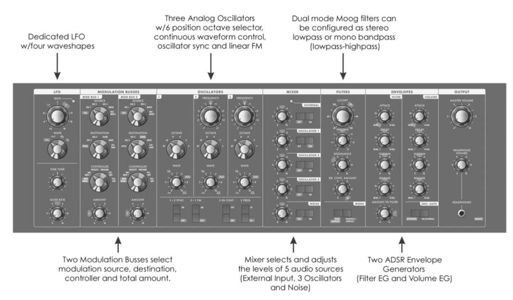
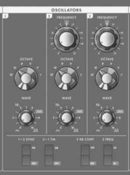
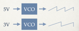
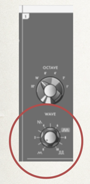
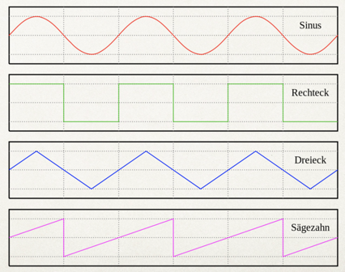
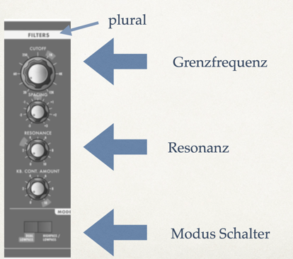
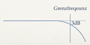
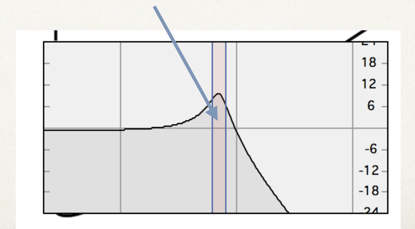
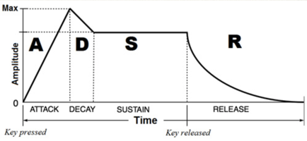

# 2 Analog Synthesiser

## Synthesizer
Ein Synthesizer ist ein Musikinstrument, welches auf elektronischem Wege per Klangsynthese Töne erzeugt. Er ist eines der zentralen Werkzeuge in der Produktion elektronischer Musik. Man unterscheidet analoge und digitale Synthesizer.

## Moog Synthesizer

[Moog Synthesizer Movie Trailer](https://www.youtube.com/watch?v=FXxkAhXL138)

## Modularsystem

Modulare Synthesizer sind elektronische Musikinstrumente, die aus einer Vielzahl von unterschiedlichen Komponenten (Module) bestehen, welche im Zusammenhang der Erzeugung elektronischer Klänge dienen.

## Minimoog Frontpanel

## Komponenten
Minimoog benutzt viele Synthesetechniken

- Additive Synthese
- Subtraktive Synthese
- Frequenz Modulation Synthese 
- wichtige Begriffe
    - LFO (Low Frequency Oscillator)
    - EG (Envelop Generator)
    
### OSC / Oszillator

Der VCO (Voltage Controller Oscillator) stellt den wichtigsten Baustein bei analogen Synthesizern dar; dies ist ein elektronischer Schwingkreis, dessen Tonfrequenz von einer Steuerspannung abhängig ist.

### Waveform

### Filter

Ein VCF (Voltage Controlled Filter) , ist ein elektronisches Filter, mit dem sich die Grenzfrequenz (engl. cutoff) mittels einer Steuerspannung variieren lässt.
Die Grenzfrequenz ist Frequenz, bei der das Eingangssignal um einen Betrag von 3 dB im Pegel abgesenkt wird.

#### Hochpassfilter

#### Tiefpassfilter

### Resonanz
Typisch für VCFs ist neben der Änderung der Klangfarbe durch die Grenzfrequenz auch die einstellbare Filter-Resonanz, diese entspricht technisch gesehen einer Rückkopplung im Bereich der Grenzfrequenz des Ausgangssignals (je nach Phasendrehung des Signals durch das Filter, abhängig von der Frequenz, kommt es zur Verstärkung oder Abschwächung des Signals).

### EG / Envelope Generator
Hüllkurvengeneratoren produzieren programmierbare Spannungsabläufe, die über den VCA zur Dynamikregelung im „mikroskopischen“ Bereich eines Klanges, aber auch zur klangfarbendynamischen Steuerung von Filtern (VCF) verwendet werden. 



Hüllkurvengeneratoren sind häufig als ADSR-Generatoren ausgeführt, dann lassen sich typischerweise vier unterschiedliche Parameter programmieren: Anschwellzeit (Attack- Time), Abklingzeit (Decay-Time), Dauerpegel (Sustain-Level) und Ausklingphase (Release- Time). Der ADSR-Generator wird z. B. beim Tastenanschlag gestartet. Der Name ADSR wird aus den Anfangsbuchstaben der Parameterbezeichnungen gebildet: Attack, Decay, Sustain, Release.

- A - Attack 
- D - Decay 
- S - Sustain
- R - Release

