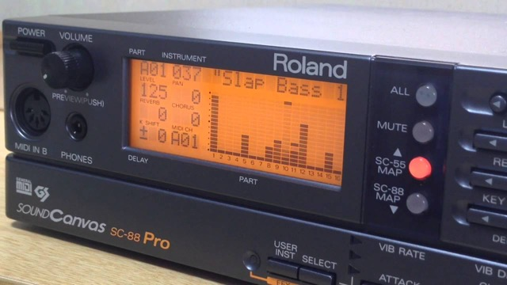
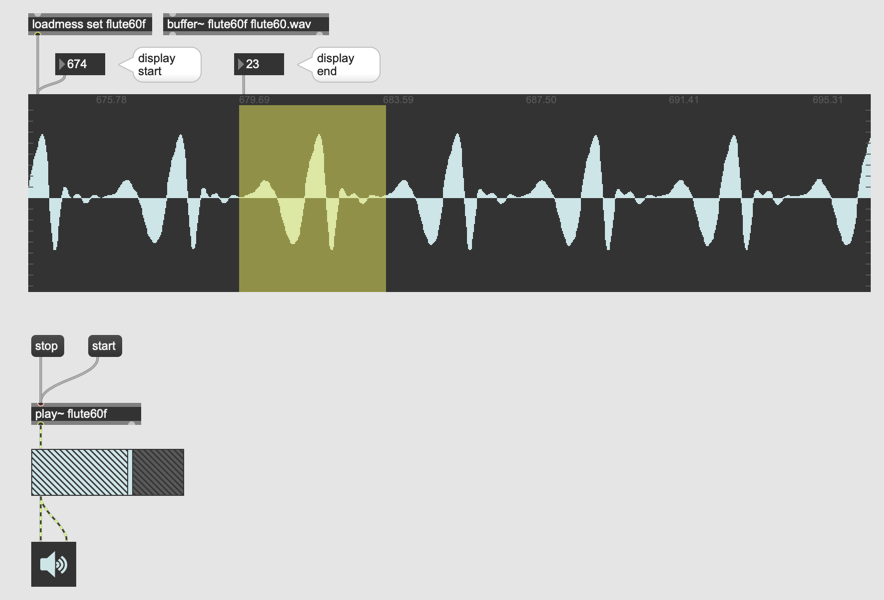
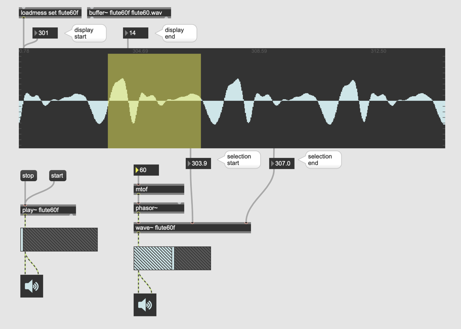
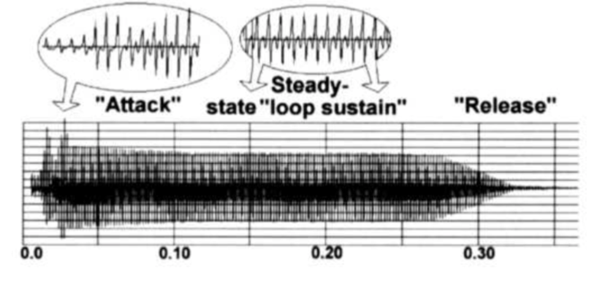
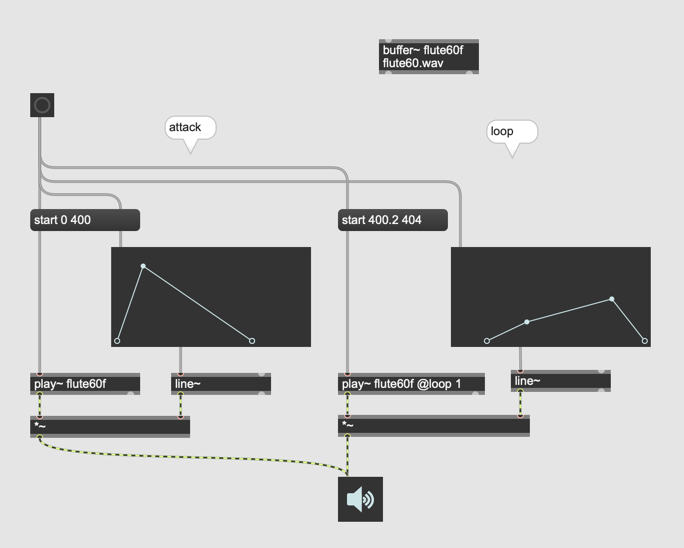
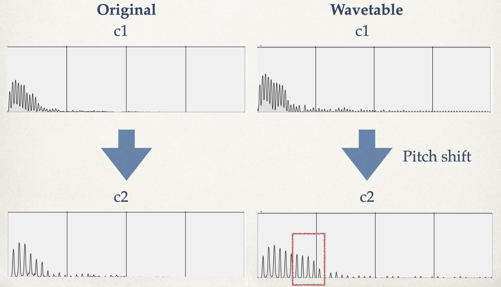
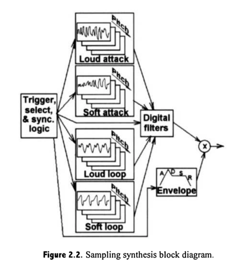
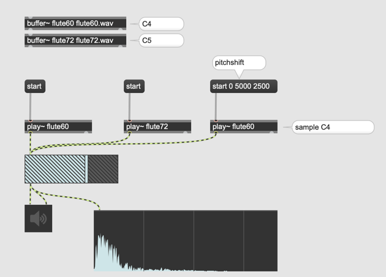

# 3 Sample-based synthesis

Die Sample-basierte Synthese wird zuweilen auch als Pulse Code Modulation (PCM) oder Sampling and Synthesis (S&S) bezeichnet und beruht auf der einfachen Idee, die simplen Wellenformen analoger Synthesizer durch die komplexen Wellenformen anderer Musikinstrumente zu ersetzen, die man mittels Sampling erfassen kann.

### Sample-based Synthesizer

### Max und Sample-based synthesis

### wave~ und Selection

### Attack und Loop

### Attack und Loop in Max

## Multisampling

Die Klangfarbe eines Instrumentes ist abhängig von Tonhöhe und Lautstärke.

### Experiment mit Max

### Vienna Symphonic Library

[Vienna Symphonic Library](https://www.vsl.co.at/de/Strings_Complete/Solo_Strings_Bundle)