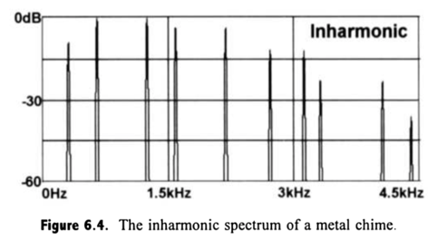

# 4 Additive Synthesis

Die additive Synthese ist eine Methode der synthetischen Klangerzeugung und wird beispielsweise in elektronischen Musikinstrumenten wie Synthesizern und Zugriegelorgeln eingesetzt. Bei der additiven Synthese wird der Klang im Gegensatz zur subtraktiven Synthese nicht dadurch erzeugt, dass man aus einem obertonreichen Spektrum die unerwünschten Bestandteile ausfiltert, sondern indem man den Klang durch Zusammenstellen der gewünschten harmonischen oder inhamonischen Teiltöne erstellt.

## harmonic /Inharmonic

