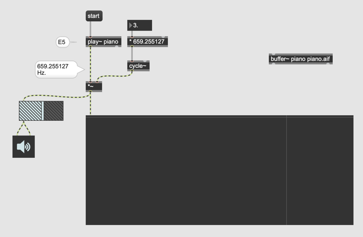
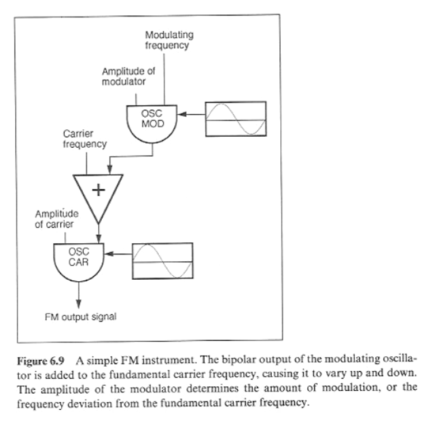
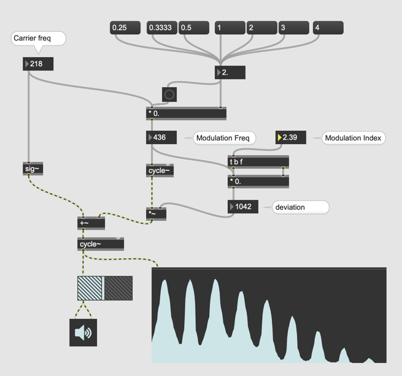
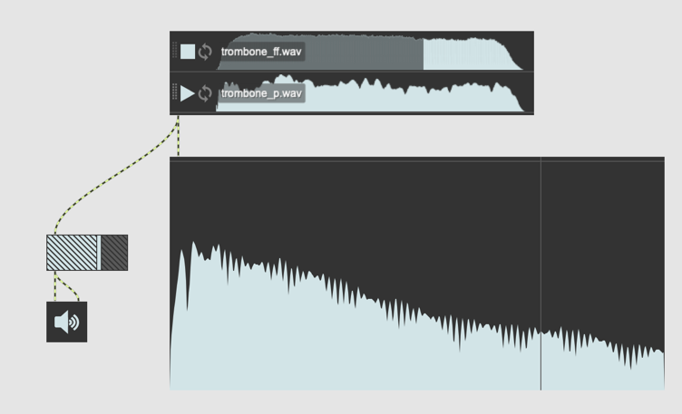
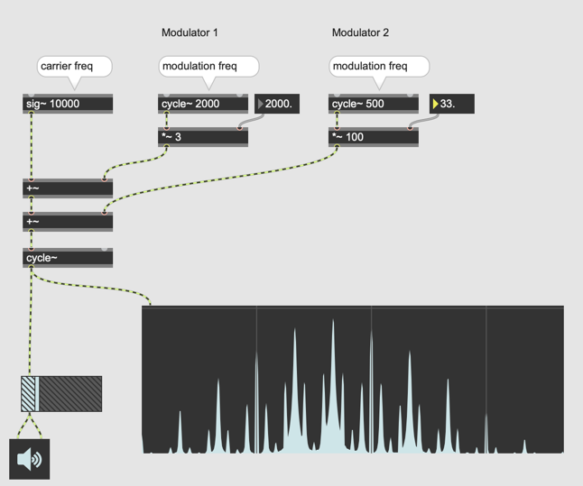

#5 Modulation Synthesis

## Bipolar / Unipolar

## Ring Modulation

### mit unterschiedlichen Quellen

### Harmonisch mit Klavier

## Amplitude Modulation

## Interpolation zwischen RM und AM

## Frequency Modulation

### John Chowning

### Motivation

- Was waren Probleme der wellentabellen, additiven und subtraktiven Synthese?
    - Wellentabellen-Synthese: nicht dynamisch
    - Additive- und subtraktive-Synthese: konsumiert CPU
zu viele Parameter

### Beispiele 

[Yamaha DX7](http://bobbyblues.recup.ch/yamaha_dx7/dx7_examples.html)

### Theorie

### Umsetzung

### Spektrum

### C:M Ratio

C ... Carrier Frequency
M ... Modulation Frequency

When C : M is a simple integer ratio, FM generates harmonic spectra, that is, sidebands that are integer multiples of the carrier and modulating frequencies. When C : M is not a simple integer ratio, FM generates inharmonic spectra. (Computer Music Tutorial)

#### Umsetzung (C:M Ratio)

#### Formant

#### Umsetzung (Formant Simulation)

#### Modulation Index

- Modulation Index = Deviation / Modulation Freq  
- Deviation = Modulation Freq * Modulation Index

#### Umsetzung (Modulation index)

#### H￿üllkurve und Parameter 

#### Lautst￿ärke und Spektrum

- [Trombone FF](K5/patches/trombone_ff.wav)
- [Trombone P](K5/patches/trombone_p.wav)

#### MMFM (Serial)

