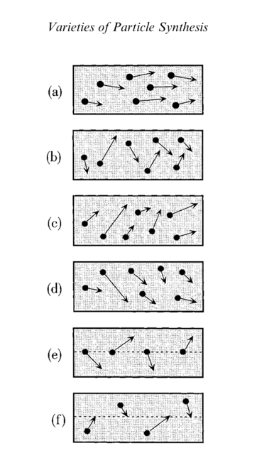
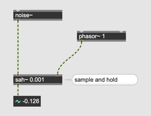
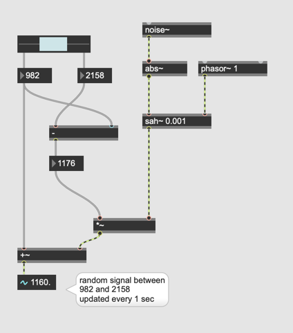
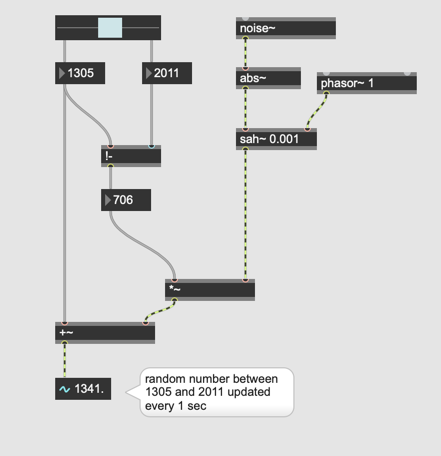
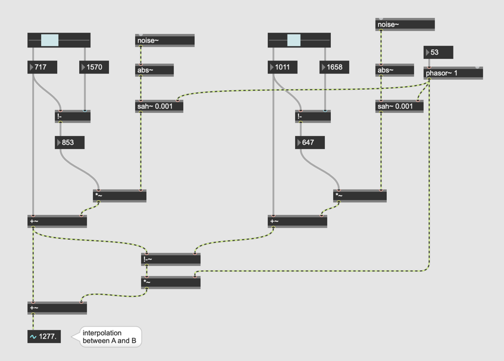
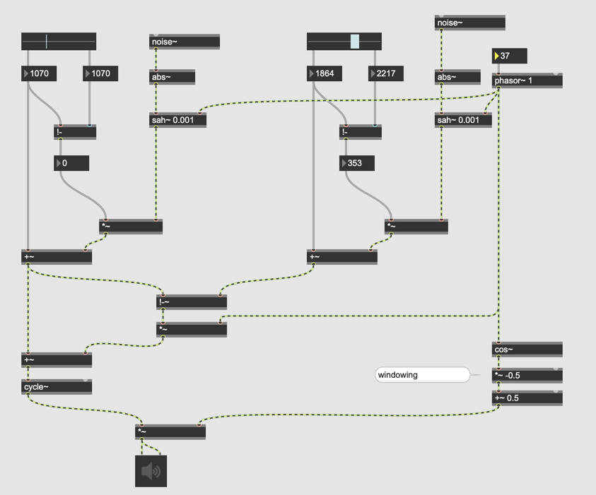

#6 Particle Synthesis

- Glisson Synthese
- Grainlet Synthese
- Trainlet Synthese
- Pulsar Synthese

## Glisson Synthese

### Umsetzung in Max

### Rauschen und sah~

### Min max

### Randomisierung

### Glissando

### mit Fensterfunktion

