#6 Particle Synthesis

- Glisson Synthese
- Trainlet Synthese
- Pulsar Synthese

## Glisson Synthese

### Umsetzung in Max

### Rauschen und sah~

### Min max

### Randomisierung

### Glissando

### mit Fensterfunktion

## Trainlet Synthese

### Impulse in Max

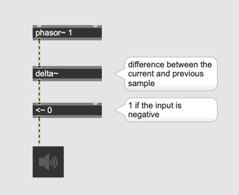

### Spectrum

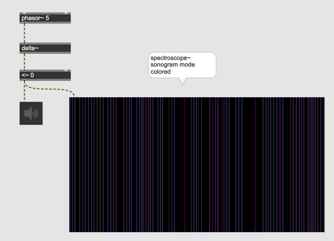

### Filter + Impulse

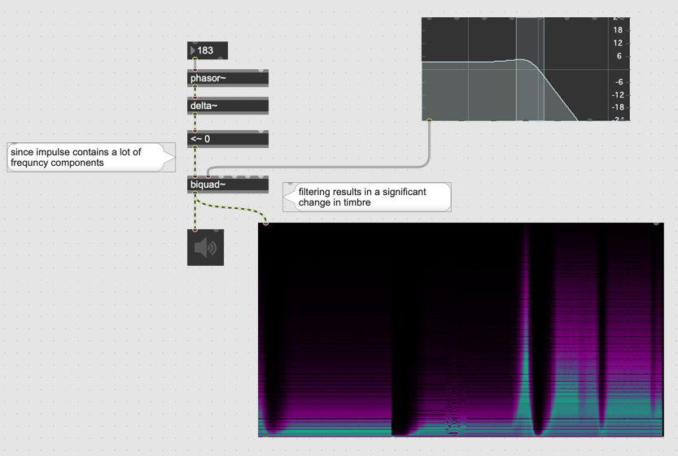

### Aliasing

> Since train let synthesis operates in the digital domain, its is
important that the impulse be band limited to avoid aliasing

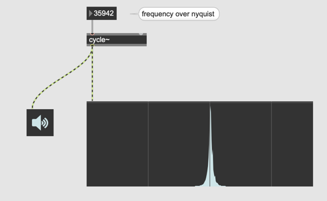

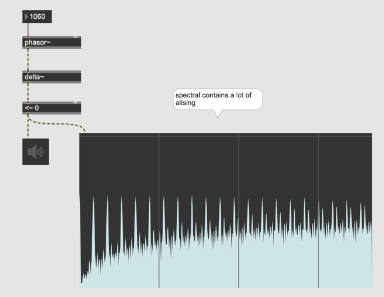

### BLIP = Band Limited Pulse

- BLIP erzugt keine Alising

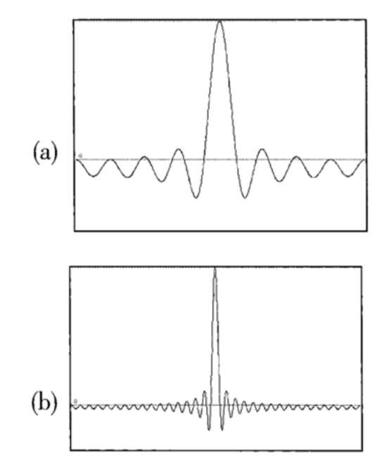

(a) Sum of eight harmonics  
(b) Sum of thirty-two harmonics

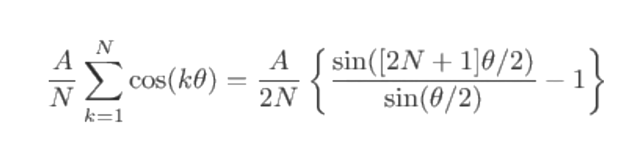

### BLIP in Max
#### Sine

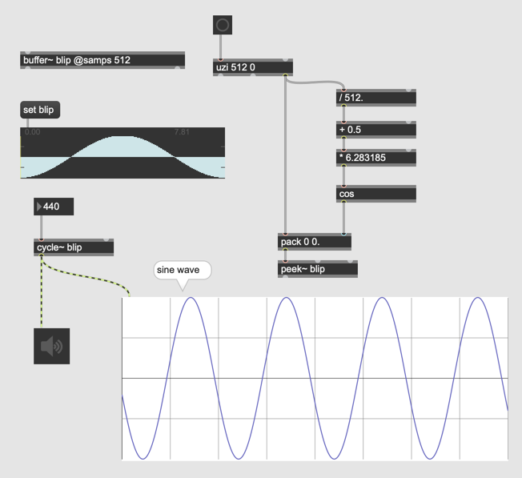

#### Harmonics
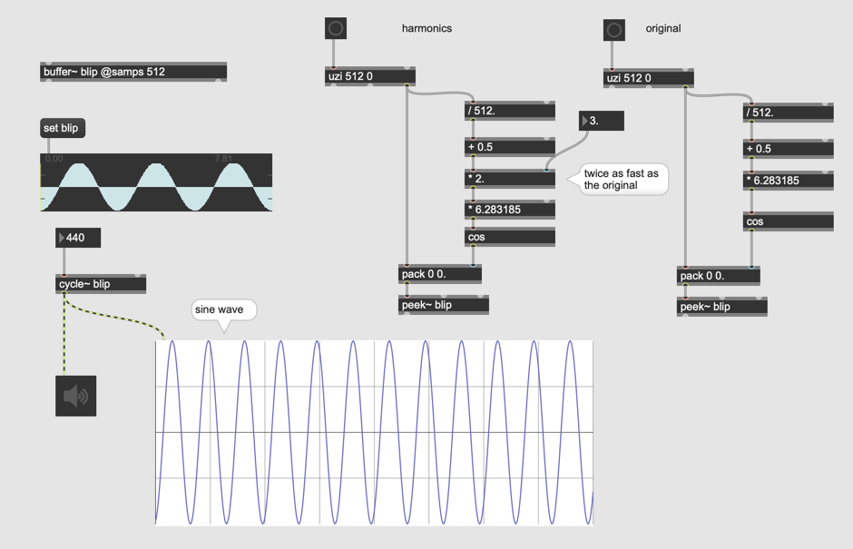

#### Akkumulation

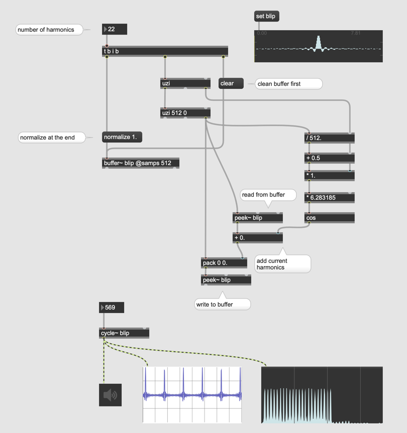

### Chroma Parameter

> Chroma is a spectral brightness factor.
>If the lowest harmonic partial has a strength coefficient of A the lowest harmonic + nth partial
 will have a coefficient of A * chroma ^ n

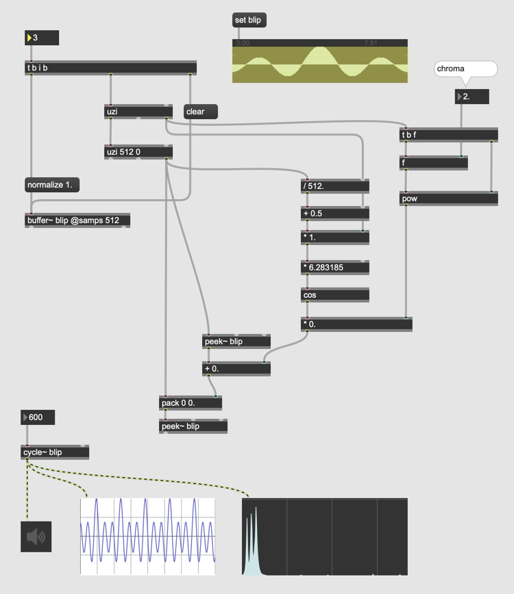

### Trainlet

> Trainlet is an acoustic particle consisting of a brief series of train of impulses ( C.Loads Micro Sound )

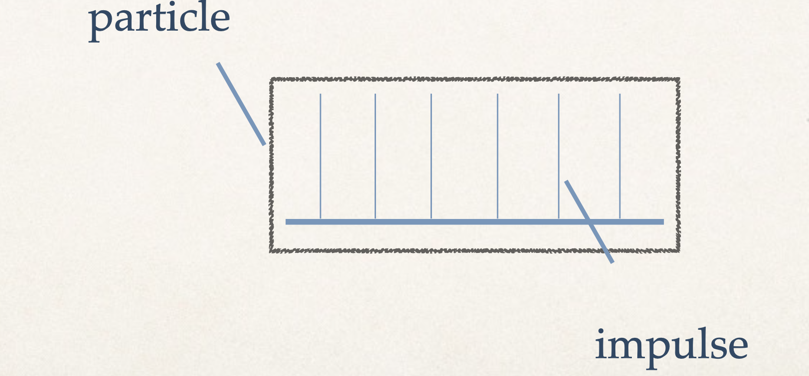

## Pulser Synthese

