#7 Formant Synthesis

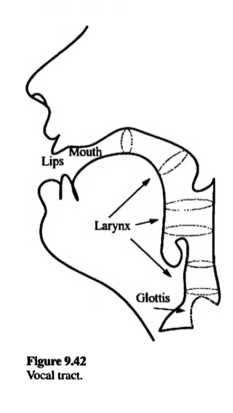

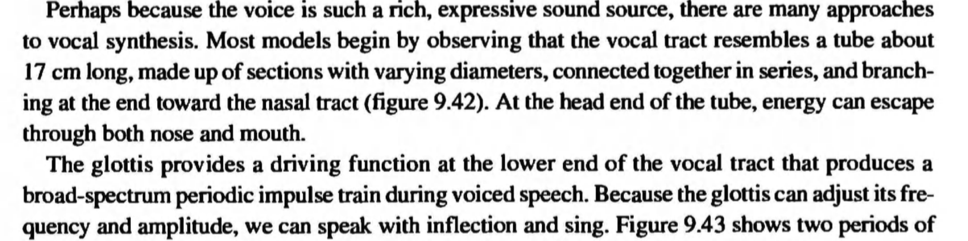

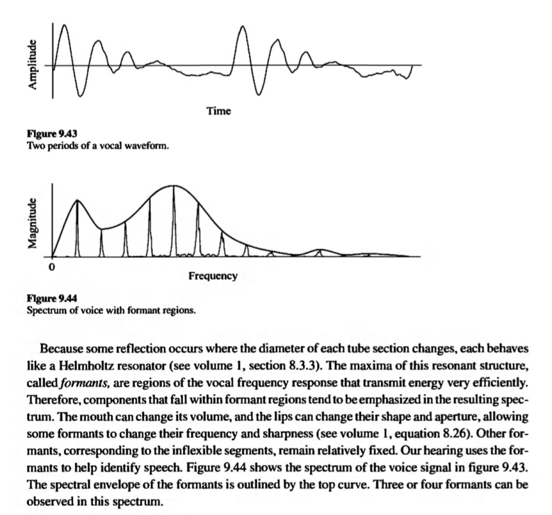

### Formant

- A Formant is a peak of energy in a spectrum, which can include both harmonic and inharmonic partials as well as noise. 

- Formant peaks are a characteristic of the spoken vowel sounds and the tone color of many musical instruments.

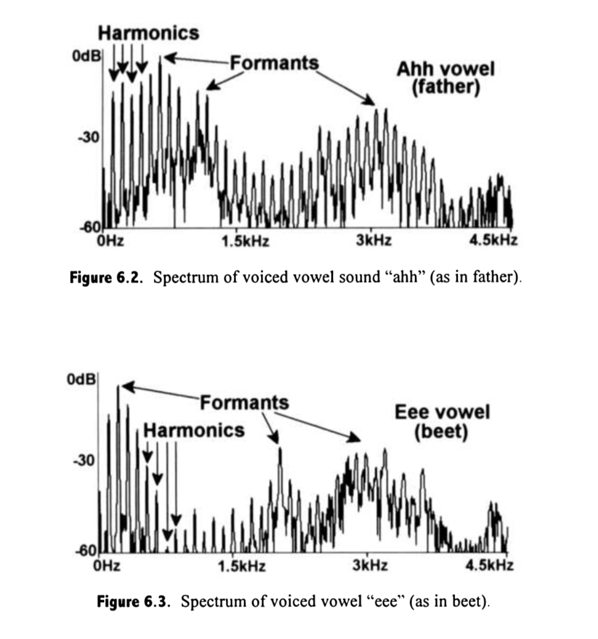

### AM Formant Simulator

#### mit AM

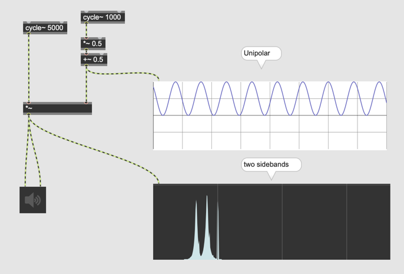

## Exponential AM

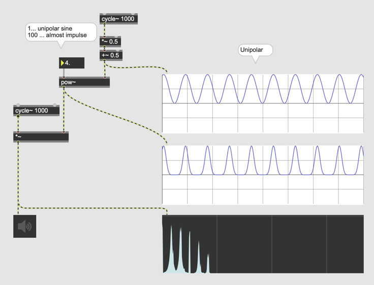

### VOSIM

Vosim = Voice Simulator

> The VOSIM waveform approximates the signal generated by the human voice in the form of a series of pulse trains, where each pulse is the square of a sine function. 
>

#### Parameter

- The parameter A sets the amplitude of the highest pulse.
- Each of the pulse trains contains N sin^2 pulses in series
- The pulses decreases in amplitude by a decay factor b
- The width (duration) of each pulse T determines the position of the formant spectrum
- A variable-length delay M follows each pulse train
- The period is N x T + M

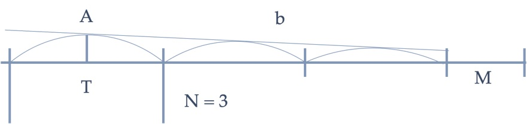

### Umsetzung in Max

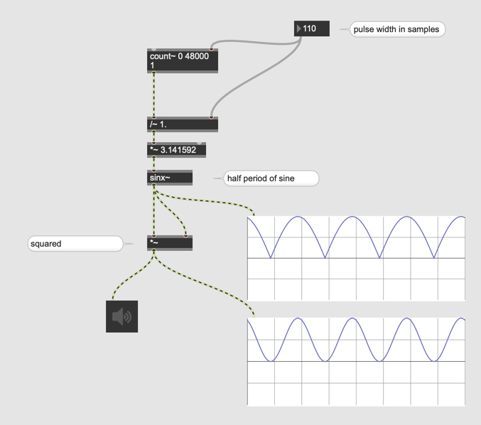

### delay
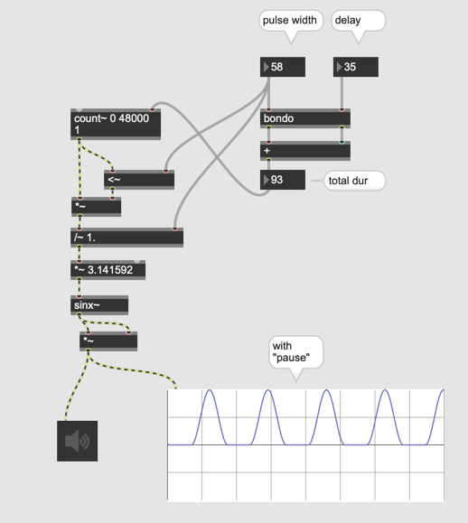

### n Pulse
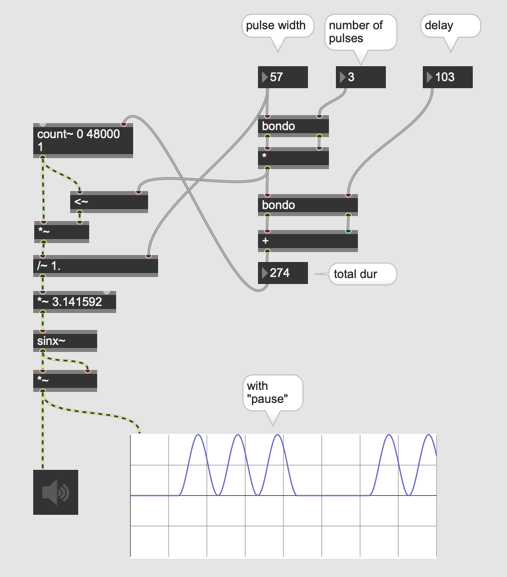

### b factor
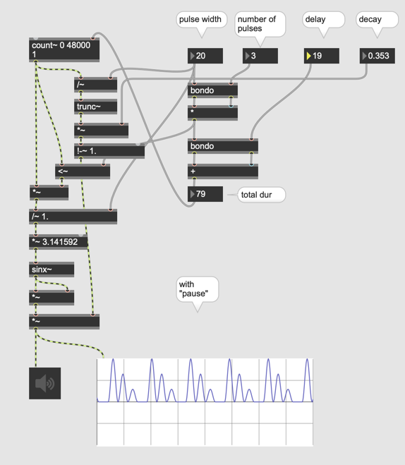

## Wave Function Synthese

## FOF
