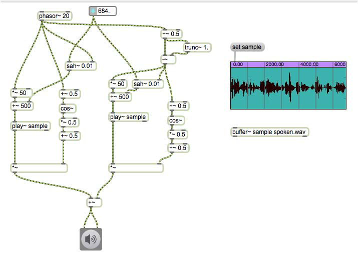

#8 granular sampling

## Basis 
### Loop

### phasor~

### Loop mit phasor~

### Grain

### Offset

### Trigonometrie

### Fensterfunktion

### Denoise

### Sample and hold

### trunc~

### Granular Sampling

## Anwendung

### Tonh￿öhe￿änderung
 

 
### Tonleiter

 
### Parametersteuerung mit Funktion

### Randomisierung

 
### Granularity

