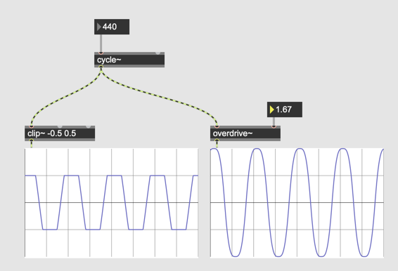
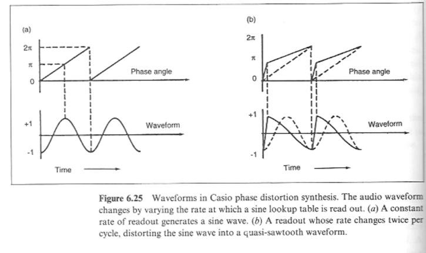
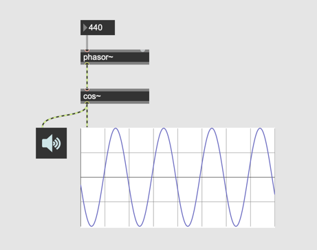
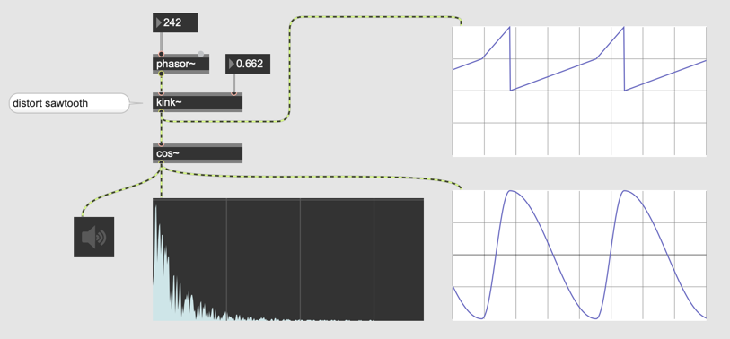
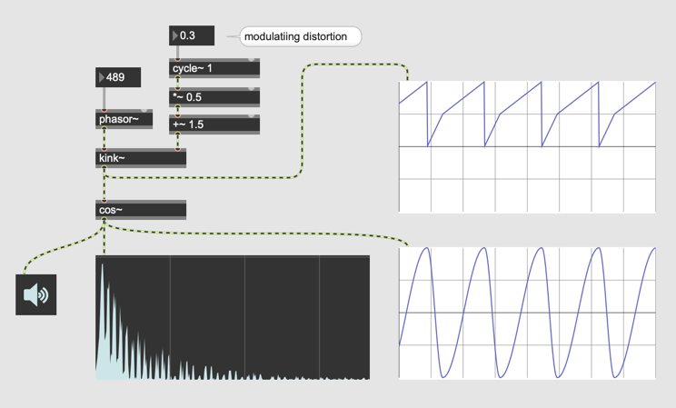
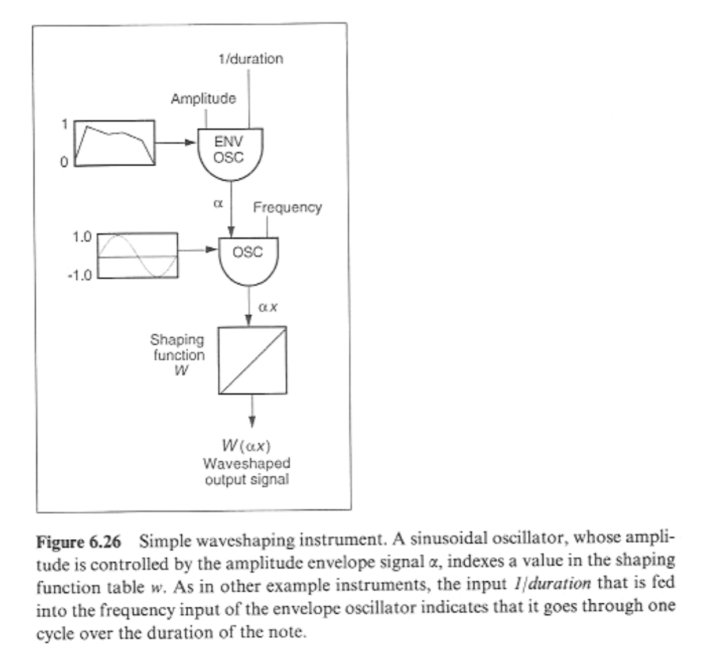
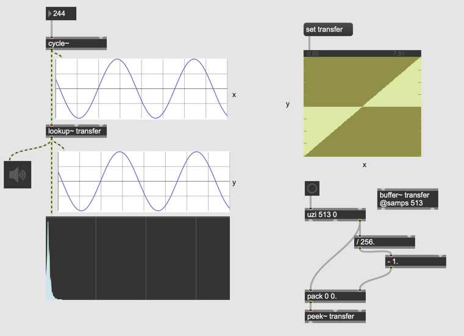
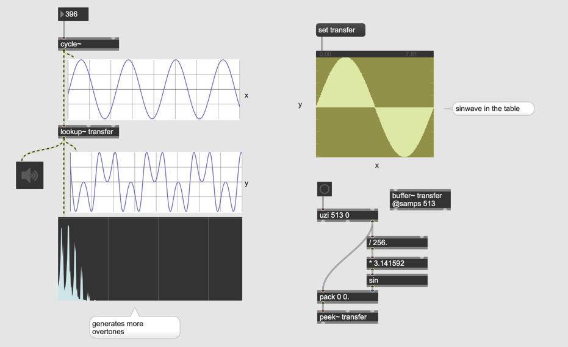
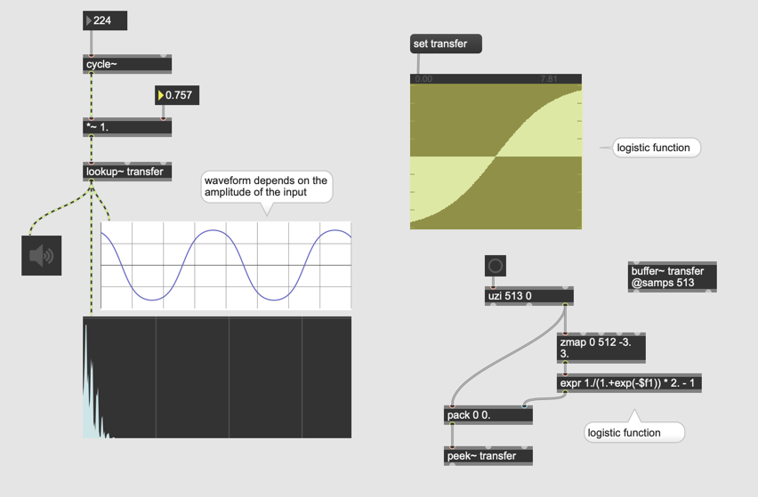
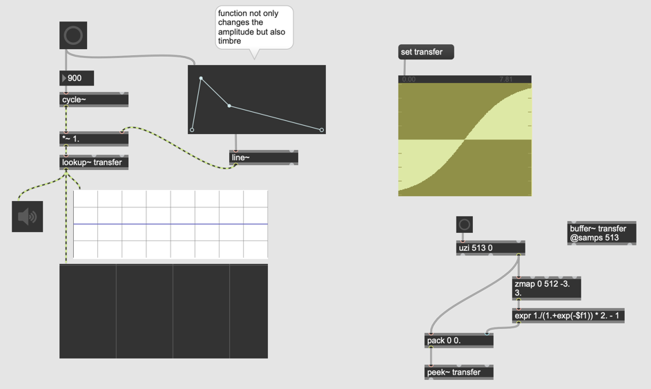

#9 Distortion Synthesis 

## Distortion in Max

## Phase Distortion

### Umsetzung in Max

### kink~

### Modulation

## Waveshaping

### Umsetzung in Max

### Andere Tabellen

### Verbindung zwischen Amplitude und Klangfarbe

### Function

