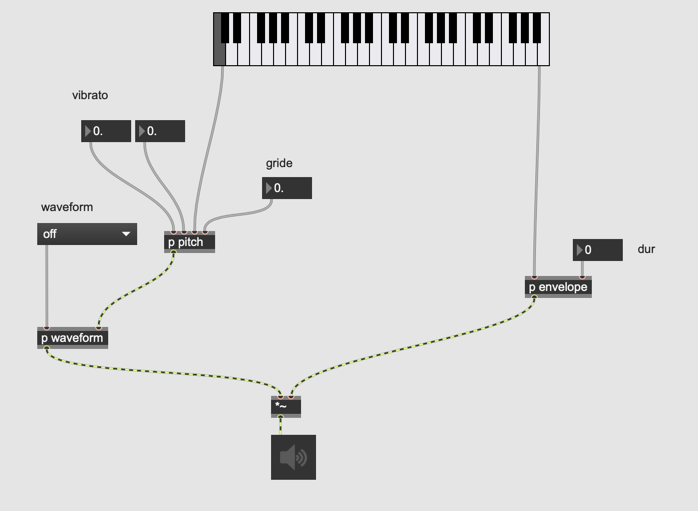
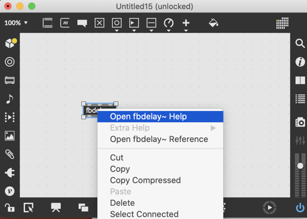
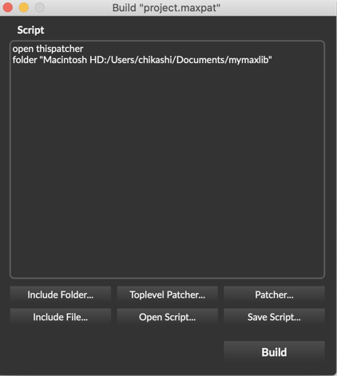
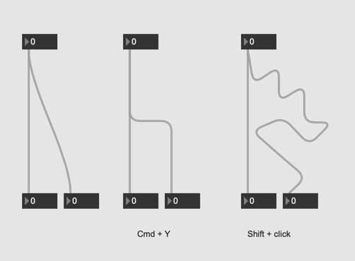
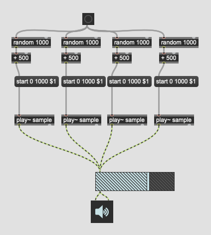

# Max Patching Style Guide

## 1 - "Separation of concerns" The most important thing when you program something

[wikiepdia](https://en.wikipedia.org/wiki/Separation_of_concerns)

## 2 - Modularize as much as possible, using patcher or abstraction

### abstractions

- patcher is like a directory, it just creates a folder to put things
- abstraction is like a template or macro, you can make multiple instances of abstractions but they are aliases; when you change the original, all of them are changed accordingly.
 
## 3 - Separate GUI and logic

### use presentation mode to hide only cables not to hide your chaos

### bpatcher should be avoided

bpatcher is attractive for analog synthesizer freaks, reaktor users, or vst-plugin lovers but it limits the UI design flexibility.

## 4 - Use send and receive with special care

### send and receive use global namespace

### should not use s and r locally

 
- you are using s and r locally because your patch is messy 

- if you find yourself tempted to use s and r locally instead of patch cords
    1. try to organize patch cord
    2. modularize your patch
    3. in case you really have to use s/r then use very specific name for that
    

### learn forward object to reduce redundant send

### consider using hierarchical message system

- the message consists of multiple parts  
 

- route distribute message  

- the message reaches the destination    

## 5 - Automation should control only GUI not DSP directly

### qlist should talk to only GUI

## 6 - Make your own library of abstractions and help files for feature you

option -> File Preferences 

### example lib patch

### example help patch

### usage
your original patch as well as help patch are accessible from anywhere

## 7 - Build application for Non-tech musicians and solve problem caused by 6

- include the library in build

## 8 - Comment should be minimal

- There two camps in the community of programmers
    - "Comments helps a lot to understand the code, you should write comments always for feature you and for other programmers"
    - "Comments are just excuses for your unsophisticated and tangled program. Avoid writing comments and clean up your program. Also if you update your code and forget updating comment, your program becomes worse than no comment." 

    
## 9 - Learn and Use git

[What is git?](https://git-scm.com/book/en/v2/Getting-Started-What-is-Git%3F)

You can systematically organize

- Your main feature vs experimental feature
- Main patches and your submodules
- History of your programming

## 10 - ADC and DAC should be on the main patch

ADC and DAC are your absolute start point and end point of your patch. These should be not hidden deep in the patchers and you should not make second and third ADC or DAC in one patch.

### Why

- you patch should tell what it is ultimately doing

- An example of modern art patch. It is hard to grasp what this patch is doing when you open this three years later  

## 11 - Prototype the frequently used GUI settings

- Customize GUI  
  

- choose Save Prototype..  
  

- name the prototype  
  

- select prototype  
  

- to remove saved prototypes

Document/Max8/Prototypes/nodes

## 12 - DSP setting can be checked and controlled in the patch

  

- unlock and disable presentation  

- force set DSP parameters  

  

## 13 - Add easy input / output tests in your patch

- level~ to check input / output signal

- a easy noise generator that sends signals to four speakers in turn

- use adoutput to convince PA guy at the concert hall it's his mistake that we don't hear any sound from the loudspeakers

## 14 - Revealed GUI in the main patch should be minimal when you rehearse with other musicians

- can you care so detailed UI doing the rehearsal?

## 15 - Consider using matrix~ for complex patching

## 16 - Learn how to manage your patch cords

## 17 - mc helps you to organize your patch more

### MC = multi channel

## Das blaue Kabel

### mc.pack~ und mc.unpack~
 

einpacken/auspacken
 
### mc.lores~
 

 
 hier sind mehrere Instanzen von mc.lores~ nicht nötig.
 
### mc.target
 

Parametersteuerung pro Kanal.

### mc.dup~

kanal duplizieren

### meter~ und levelmeter~

 
### multigain~

## Anwendungsbeispiel

### Vocoder

#### Before

#### After

### Massive Sample

#### Before

#### After

## 18 - Learn what poly~ can do

[Poly~ kurs](https://github.com/chikashimiyama/Software1_HFMT_WS_2017/blob/master/K2.md)